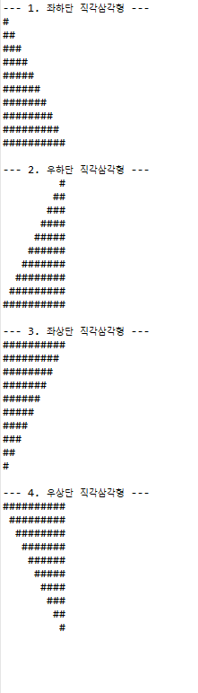
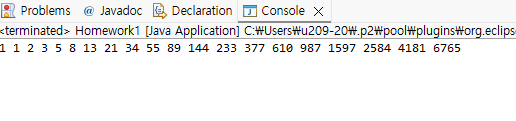
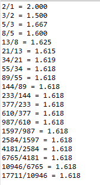
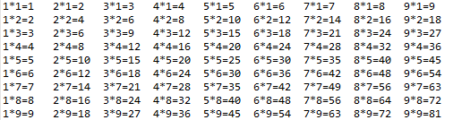
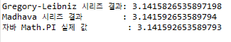
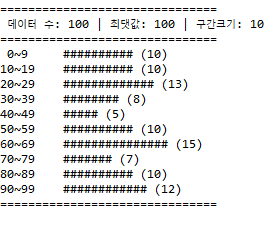

# OOP2026
### Homework1
```java
public class Homework1 {
    public static void main(String[] args) {
        int n = 10;

        // 1. 좌하단 직각삼각형 (왼쪽 정렬, 밑으로 갈수록 길어짐)
        System.out.println("--- 1. 좌하단 직각삼각형 ---");
        for (int i = 1; i <= n; i++) {
            for (int j = 1; j <= i; j++) {
                System.out.print("#");
            }
            System.out.println();
        }

        System.out.println();

        // 2. 우하단 직각삼각형 (오른쪽 정렬, 밑으로 갈수록 길어짐)
        System.out.println("--- 2. 우하단 직각삼각형 ---");
        for (int i = 1; i <= n; i++) {
            for (int j = 1; j <= n - i; j++) {
                System.out.print(" ");
            }
            for (int j = 1; j <= i; j++) {
                System.out.print("#");
            }
            System.out.println();
        }

        System.out.println();

        // 3. 좌상단 직각삼각형 (왼쪽 정렬, 밑으로 갈수록 짧아짐)
        System.out.println("--- 3. 좌상단 직각삼각형 ---");
        for (int i = n; i >= 1; i--) {
            for (int j = 1; j <= i; j++) {
                System.out.print("#");
            }
            System.out.println();
        }

        System.out.println();

        // 4. 우상단 직각삼각형 (오른쪽 정렬, 밑으로 갈수록 짧아짐)
        System.out.println("--- 4. 우상단 직각삼각형 ---");
        for (int i = n; i >= 1; i--) {
            for (int j = 1; j <= n - i; j++) {
                System.out.print(" ");
            }
            for (int j = 1; j <= i; j++) {
                System.out.print("#");
            }
            System.out.println();
        }
    }
}
```


### Homework2
```java

public class Homework2 {
    public static void main(String[] args) {
        int n = 20;
        int first = 1;
        int second = 1;

        System.out.print(first + " " + second + " ");

        for (int i = 3; i <= n; i++) {
            int next = first + second;
            System.out.print(next + " ");
            
            // 다음 계산을 위한 값 교체
            first = second;
            second = next;
        }
    }
}
```


### Homework3
```java
public class Homework1 {
    public static void main(String[] args) {
        int n = 20;
        long a = 1; // 첫 번째 항
        long b = 1; // 두 번째 항

        for (int i = 1; i <= n; i++) {
            long next = a + b;
            
            // 소수점 계산을 위해 double형으로 변환 후 나눗셈
            double ratio = (double) next / b;
            
            System.out.printf("%d/%d = %.3f\n", next, b, ratio);

            // 다음 항 계산을 위한 값 갱신
            a = b;
            b = next;
        }
    }
}
```


### Homework4
```java
public class Homework1 {
    public static void main(String[] args) {
        // 1부터 9까지 곱하는 수 (행)
        for (int i = 1; i <= 9; i++) {
            // 1단부터 9단까지 (열)
            for (int dan = 1; dan <= 9; dan++) {
                // \t(탭)을 사용하여 열 간격을 일정하게 정렬
                System.out.printf("%d*%d=%-2d\t", dan, i, dan * i);
            }
            System.out.println(); // 한 줄 출력이 끝나면 줄바꿈
        }
    }
}
```


### Homework5
```java
public class Homework1 {
    public static void main(String[] args) {
        int iterations = 100000; // 반복 횟수

        // 1. Gregory–Leibniz Series
        double piLeibniz = 0.0;
        double sign = 1.0;
        for (int i = 0; i < iterations; i++) {
            double denominator = 2 * i + 1;
            piLeibniz += sign * (4.0 / denominator);
            sign = -sign; // 부호 반전 (+, -)
        }

        // 2. Madhava Series
        double madhavaSum = 0.0;
        for (int k = 0; k < iterations; k++) {
            double term = Math.pow(-1.0 / 3.0, k) / (2 * k + 1);
            madhavaSum += term;
        }
        double piMadhava = Math.sqrt(12) * madhavaSum;

        // 결과 출력
        System.out.println("Gregory-Leibniz 시리즈 결과: " + piLeibniz);
        System.out.println("Madhava 시리즈 결과        : " + piMadhava);
        System.out.println("자바 Math.PI 실제 값        : " + Math.PI);
    }
}
```


### Homework10
```java
public class Homework10 {
    public static void main(String[] args) {
        // 기본값 설정 (명령어 인자가 부족할 경우 대비)
        // 형식: histogram array_count max_value bin_size display_scale
        int arrayCount = 100;   // 데이터 개수
        int maxValue = 100;     // 최댓값 범위 (0 ~ 99)
        int binSize = 10;       // 계급 구간 크기 (예: 10개씩 묶음)
        int displayScale = 1;   // 그래프 스케일 (# 1개당 데이터 개수)

        // args 파싱 처리 (사용자 제공 코드 반영)
        if (args.length >= 4) {
            try {
                arrayCount = Integer.parseInt(args[0]);
                maxValue = Integer.parseInt(args[1]);
                binSize = Integer.parseInt(args[2]);
                displayScale = Integer.parseInt(args[3]);
            } catch (NumberFormatException e) {
                System.out.println("⚠️ 인자값은 모두 정수여야 합니다. 기본값을 사용합니다.");
            }
        }

        // 1. 난수 데이터 생성 (Math.random 활용)
        int[] data = new int[arrayCount];
        for (int i = 0; i < data.length; i++) {
            data[i] = (int)(Math.random() * maxValue); // 0부터 maxValue - 1 사이의 값
        }

        // 2. 도수분포표 구간(Bin) 개수 계산 및 빈도수 집계
        int numBins = (int) Math.ceil((double) maxValue / binSize);
        int[] bins = new int[numBins];

        for (int val : data) {
            int binIndex = val / binSize;
            if (binIndex < numBins) {
                bins[binIndex]++;
            } else {
                bins[numBins - 1]++; // 예외 방지 (최댓값 경계 처리)
            }
        }

        // 3. 결과 출력 (히스토그램 형태)
        System.out.println("===============================");
        System.out.printf(" 데이터 수: %d | 최댓값: %d | 구간크기: %d\n", arrayCount, maxValue, binSize);
        System.out.println("===============================");
        
        for (int i = 0; i < numBins; i++) {
            int start = i * binSize;
            int end = Math.min(start + binSize - 1, maxValue - 1);
            
            // 구간 문자열 (예: 0~9)
            String rangeStr = String.format("%2d~%-2d", start, end);
            
            // 빈도수에 따른 '#' 기호 생성
            int hashCount = bins[i] / displayScale;
            StringBuilder hashes = new StringBuilder();
            for (int h = 0; h < hashCount; h++) {
                hashes.append("#");
            }

            // 출력
            System.out.printf("%s \t %s (%d)\n", rangeStr, hashes.toString(), bins[i]);
        }
        System.out.println("===============================");
    }
}

```

