# OOP2026
### Homework1
```java
public class Homework1 {
    public static void main(String[] args) {
        int n = 10;

        // 1. 좌하단 직각삼각형 (왼쪽 정렬, 밑으로 갈수록 길어짐)
        System.out.println("--- 1. 좌하단 직각삼각형 ---");
        for (int i = 1; i <= n; i++) {
            for (int j = 1; j <= i; j++) {
                System.out.print("#");
            }
            System.out.println();
        }

        System.out.println();

        // 2. 우하단 직각삼각형 (오른쪽 정렬, 밑으로 갈수록 길어짐)
        System.out.println("--- 2. 우하단 직각삼각형 ---");
        for (int i = 1; i <= n; i++) {
            for (int j = 1; j <= n - i; j++) {
                System.out.print(" ");
            }
            for (int j = 1; j <= i; j++) {
                System.out.print("#");
            }
            System.out.println();
        }

        System.out.println();

        // 3. 좌상단 직각삼각형 (왼쪽 정렬, 밑으로 갈수록 짧아짐)
        System.out.println("--- 3. 좌상단 직각삼각형 ---");
        for (int i = n; i >= 1; i--) {
            for (int j = 1; j <= i; j++) {
                System.out.print("#");
            }
            System.out.println();
        }

        System.out.println();

        // 4. 우상단 직각삼각형 (오른쪽 정렬, 밑으로 갈수록 짧아짐)
        System.out.println("--- 4. 우상단 직각삼각형 ---");
        for (int i = n; i >= 1; i--) {
            for (int j = 1; j <= n - i; j++) {
                System.out.print(" ");
            }
            for (int j = 1; j <= i; j++) {
                System.out.print("#");
            }
            System.out.println();
        }
    }
}
```
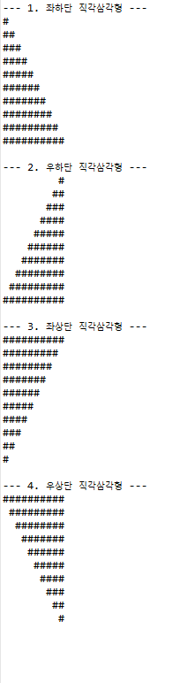

### Homework2
```java

public class Homework2 {
    public static void main(String[] args) {
        int n = 20;
        int first = 1;
        int second = 1;

        System.out.print(first + " " + second + " ");

        for (int i = 3; i <= n; i++) {
            int next = first + second;
            System.out.print(next + " ");
            
            // 다음 계산을 위한 값 교체
            first = second;
            second = next;
        }
    }
}
```
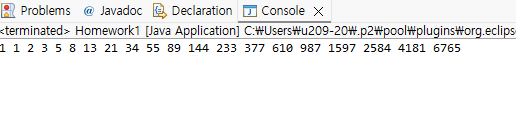

### Homework3
```java
public class Homework3 {
    public static void main(String[] args) {
        int n = 20;
        long a = 1; // 첫 번째 항
        long b = 1; // 두 번째 항

        for (int i = 1; i <= n; i++) {
            long next = a + b;
            
            // 소수점 계산을 위해 double형으로 변환 후 나눗셈
            double ratio = (double) next / b;
            
            System.out.printf("%d/%d = %.3f\n", next, b, ratio);

            // 다음 항 계산을 위한 값 갱신
            a = b;
            b = next;
        }
    }
}
```
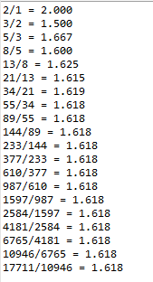

### Homework4
```java
public class Homework4 {
    public static void main(String[] args) {
        // 1부터 9까지 곱하는 수 (행)
        for (int i = 1; i <= 9; i++) {
            // 1단부터 9단까지 (열)
            for (int dan = 1; dan <= 9; dan++) {
                // \t(탭)을 사용하여 열 간격을 일정하게 정렬
                System.out.printf("%d*%d=%-2d\t", dan, i, dan * i);
            }
            System.out.println(); // 한 줄 출력이 끝나면 줄바꿈
        }
    }
}
```
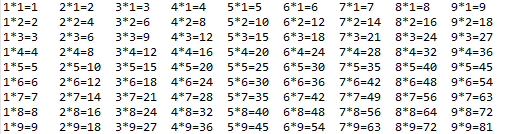

### Homework5
```java
public class Homework5 {
    public static void main(String[] args) {
        int iterations = 100000; // 반복 횟수

        // 1. Gregory–Leibniz Series
        double piLeibniz = 0.0;
        double sign = 1.0;
        for (int i = 0; i < iterations; i++) {
            double denominator = 2 * i + 1;
            piLeibniz += sign * (4.0 / denominator);
            sign = -sign; // 부호 반전 (+, -)
        }

        // 2. Madhava Series
        double madhavaSum = 0.0;
        for (int k = 0; k < iterations; k++) {
            double term = Math.pow(-1.0 / 3.0, k) / (2 * k + 1);
            madhavaSum += term;
        }
        double piMadhava = Math.sqrt(12) * madhavaSum;

        // 결과 출력
        System.out.println("Gregory-Leibniz 시리즈 결과: " + piLeibniz);
        System.out.println("Madhava 시리즈 결과        : " + piMadhava);
        System.out.println("자바 Math.PI 실제 값        : " + Math.PI);
    }
}
```
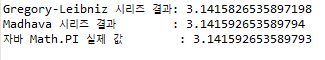

### Homework6
```java
public class Homework6 {
    public static void main(String[] args) {
        int n = 7; // 출력할 행의 수
        int[][] binomial = new int[n][];

        // 1. 파스칼의 삼각형(이항계수) 배열 생성 및 계산
        for (int i = 0; i < n; i++) {
            binomial[i] = new int[i + 1];
            binomial[i][0] = 1;       // 각 행의 첫 번째 값은 1
            binomial[i][i] = 1;       // 각 행의 마지막 값은 1

            // 가운데 값 계산: C(n, k) = C(n-1, k-1) + C(n-1, k)
            for (int j = 1; j < i; j++) {
                binomial[i][j] = binomial[i - 1][j - 1] + binomial[i - 1][j];
            }
        }

        // 2. 파스칼의 삼각형 출력
        for (int i = 0; i < n; i++) {
            for (int j = 0; j <= i; j++) {
                System.out.print(binomial[i][j] + " ");
            }
            System.out.println();
        }

        System.out.println();

        // 3. (a+b)^n 형태로 이항정리 전개식 출력 (n=2부터 4까지 예시 출력)
        for (int power = 2; power <= 4; power++) {
            System.out.print("(a+b)^" + power + "=");
            
            for (int k = 0; k <= power; k++) {
                int coeff = binomial[power][k]; // 계수
                int aExp = power - k;           // a의 지수
                int bExp = k;                   // b의 지수

                if (k > 0) System.out.print("+");

                // 계수가 1인 경우 생략 (단, 항 전체에서 숫자가 사라지는 것을 방지)
                if (coeff > 1) {
                    System.out.print(coeff);
                }

                // a의 지수 표기
                if (aExp == 1) {
                    System.out.print("a");
                } else if (aExp > 1) {
                    System.out.print("a^" + aExp);
                }

                // b의 지수 표기
                if (bExp == 1) {
                    System.out.print("b");
                } else if (bExp > 1) {
                    System.out.print("b^" + bExp);
                }
            }
            System.out.println();
        }
    }
}
```
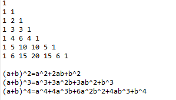

### Homework7
```java
public class Homework7 {
    public static void main(String[] args) {
        int[] data = new int[20];

        // 1. 난수 생성 (0 ~ 99)
        for (int i = 0; i < 20; i++) {
            data[i] = (int) (Math.random() * 100);
        }

        // 정렬 전 배열 출력
        System.out.println("=== 정렬 전 ===");
        printArray(data);

        // 2. 선택 정렬 (Selection Sort) 알고리즘
        for (int i = 0; i < data.length - 1; i++) {
            int minIndex = i; // 최솟값이 위치한 인덱스 저장

            // i 이후의 요소들 중 가장 작은 값의 인덱스를 찾음
            for (int j = i + 1; j < data.length; j++) {
                if (data[j] < data[minIndex]) {
                    minIndex = j;
                }
            }

            // 찾은 최솟값과 현재 위치(i)의 값을 교환 (Swap)
            int temp = data[i];
            data[i] = data[minIndex];
            data[minIndex] = temp;
        }

        // 3. 정렬 후 배열 출력
        System.out.println("\n=== 선택 정렬 후 (오름차순) ===");
        printArray(data);
    }

    // 배열 출력용 메서드
    private static void printArray(int[] arr) {
        for (int i = 0; i < arr.length; i++) {
            System.out.print(arr[i] + " ");
        }
        System.out.println();
    }
}
```
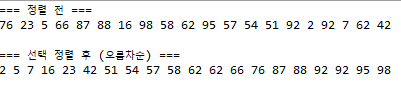

### Homework8
```java
public class Homework8 {
    public static void main(String[] args) {
        int students = 30;
        int subjects = 4; // 국, 영, 수, 과
        
        // 30명 학생, 4개 과목 성적 저장 2차원 배열
        int[][] score = new int[students][subjects];

        // 성적 헤더 출력
        System.out.printf("%-4s %-5s %-5s %-5s %-5s %-5s\n", "번호", "국어", "영어", "수학", "과학", "총점");
        System.out.println("------------------------------------");

        for (int i = 0; i < students; i++) {
            int sum = 0;

            // 과목별 점수 생성 (0~100) 및 총점 계산
            for (int j = 0; j < subjects; j++) {
                score[i][j] = (int) (Math.random() * 101); // 0 ~ 100
                sum += score[i][j];
            }

            // 학생 번호, 4과목 점수, 총점 출력
            System.out.printf("%-4d %-5d %-5d %-5d %-5d %-5d\n", 
                (i + 1), score[i][0], score[i][1], score[i][2], score[i][3], sum);
        }
    }
}
```
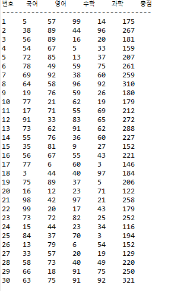

### Homework9
```java
public class Homework9 {
    public static void main(String[] args) {
        // 1. 정수 10진수 -> 2진수
        System.out.println("=== 정수 10진수 -> 2진수 ===");
        printDecToBin(257);
        printDecToBin(128);

        // 2. 정수 2진수 -> 10진수
        System.out.println("\n=== 정수 2진수 -> 10진수 ===");
        printBinToDec("101010");
        printBinToDec("1110");

        // 3. 실수 10진수 -> 2진수 (이미지 원리 적용)
        System.out.println("\n=== 실수 10진수 -> 2진수 ===");
        double[] decimals = {1.75, 1.625, 1.5625, 1.875, 13.875, 45.875, 1.9, 1.1};
        for (double d : decimals) {
            System.out.println("(" + d + ")_10 = (" + floatToBinary(d, 20) + ")_2");
        }
    }

    // 10진수 정수를 2진수로 변환
    public static void printDecToBin(int n) {
        System.out.println("(" + n + ")_10 = (" + Integer.toBinaryString(n) + ")_2");
    }

    // 2진수 문자열을 10진수로 변환
    public static void printBinToDec(String bin) {
        System.out.println("(" + bin + ")_2 = (" + Integer.parseInt(bin, 2) + ")_10");
    }

    // 실수 10진수를 2진수 문자열로 변환 (정수부: 나누기, 소수부: 곱하기)
    public static String floatToBinary(double number, int maxPrecision) {
        int intPart = (int) number;            // 정수 부분
        double fracPart = number - intPart;    // 소수 부분

        // 정수 부분 2진수 변환 (2로 나누기 반복)
        String intBinary = Integer.toBinaryString(intPart);

        // 소수 부분 2진수 변환 (2를 곱하기 반복)
        StringBuilder fracBinary = new StringBuilder();
        int count = 0;
        
        while (fracPart > 0 && count < maxPrecision) {
            fracPart *= 2;
            int bit = (int) fracPart;
            fracBinary.append(bit);
            fracPart -= bit;
            count++;
        }

        if (fracBinary.length() > 0) {
            return intBinary + "." + fracBinary.toString();
        } else {
            return intBinary;
        }
    }
}
```
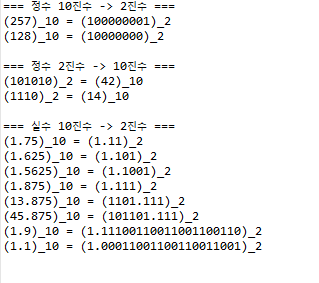

### Homework10
```java
public class Homework10 {
    public static void main(String[] args) {
        // 기본값 설정 (명령어 인자가 부족할 경우 대비)
        // 형식: histogram array_count max_value bin_size display_scale
        int arrayCount = 100;   // 데이터 개수
        int maxValue = 100;     // 최댓값 범위 (0 ~ 99)
        int binSize = 10;       // 계급 구간 크기 (예: 10개씩 묶음)
        int displayScale = 1;   // 그래프 스케일 (# 1개당 데이터 개수)

        // args 파싱 처리 (사용자 제공 코드 반영)
        if (args.length >= 4) {
            try {
                arrayCount = Integer.parseInt(args[0]);
                maxValue = Integer.parseInt(args[1]);
                binSize = Integer.parseInt(args[2]);
                displayScale = Integer.parseInt(args[3]);
            } catch (NumberFormatException e) {
                System.out.println("⚠️ 인자값은 모두 정수여야 합니다. 기본값을 사용합니다.");
            }
        }

        // 1. 난수 데이터 생성 (Math.random 활용)
        int[] data = new int[arrayCount];
        for (int i = 0; i < data.length; i++) {
            data[i] = (int)(Math.random() * maxValue); // 0부터 maxValue - 1 사이의 값
        }

        // 2. 도수분포표 구간(Bin) 개수 계산 및 빈도수 집계
        int numBins = (int) Math.ceil((double) maxValue / binSize);
        int[] bins = new int[numBins];

        for (int val : data) {
            int binIndex = val / binSize;
            if (binIndex < numBins) {
                bins[binIndex]++;
            } else {
                bins[numBins - 1]++; // 예외 방지 (최댓값 경계 처리)
            }
        }

        // 3. 결과 출력 (히스토그램 형태)
        System.out.println("===============================");
        System.out.printf(" 데이터 수: %d | 최댓값: %d | 구간크기: %d\n", arrayCount, maxValue, binSize);
        System.out.println("===============================");
        
        for (int i = 0; i < numBins; i++) {
            int start = i * binSize;
            int end = Math.min(start + binSize - 1, maxValue - 1);
            
            // 구간 문자열 (예: 0~9)
            String rangeStr = String.format("%2d~%-2d", start, end);
            
            // 빈도수에 따른 '#' 기호 생성
            int hashCount = bins[i] / displayScale;
            StringBuilder hashes = new StringBuilder();
            for (int h = 0; h < hashCount; h++) {
                hashes.append("#");
            }

            // 출력
            System.out.printf("%s \t %s (%d)\n", rangeStr, hashes.toString(), bins[i]);
        }
        System.out.println("===============================");
    }
### Homework11
```java
import java.util.Arrays;
import java.util.Scanner;

public class Main {
    public static void main(String[] args) {
        Scanner sc = new Scanner(System.in);
        
        System.out.print("데이터 개수 입력: ");
        int array_count = sc.nextInt();
        
        int[] arr = new int[array_count];
        
   
        for (int i = 0; i < array_count; i++) {
            arr[i] = (int) (Math.random() * 100) + 1;
        }
        
    
        System.out.print("생성된 데이터: ");
        for (int i = 0; i < array_count; i++) {
            System.out.print(arr[i] + " ");
        }
        System.out.println("\n");
        
    
        double sum = 0;
        for (int i = 0; i < array_count; i++) {
            sum += arr[i];
        }
        double arithmeticMean = sum / array_count;
        
    
        double prod = 1.0;
        for (int i = 0; i < array_count; i++) {
            prod *= arr[i];
        }
        double geometricMean = Math.pow(prod, 1.0 / array_count);
        
      
        double harmonicSum = 0;
        for (int i = 0; i < array_count; i++) {
            harmonicSum += 1.0 / arr[i];
        }
        double harmonicMean = array_count / harmonicSum;
        
      
        int[] sortedArr = arr.clone();
        Arrays.sort(sortedArr);
        double median;
        if (array_count % 2 == 1) {
            median = sortedArr[array_count / 2];
        } else {
            median = (sortedArr[array_count / 2 - 1] + sortedArr[array_count / 2]) / 2.0;
        }
        
      
        System.out.println("=== [통계 계산 결과] ===");
        System.out.printf("산술평균 (Arithmetic Mean) : %.4f\n", arithmeticMean);
        System.out.printf("기하평균 (Geometric Mean)  : %.4f\n", geometricMean);
        System.out.printf("조화평균 (Harmonic Mean)   : %.4f\n", harmonicMean);
        System.out.printf("중앙값 (Median)            : %.4f\n", median);
        
        sc.close();
    }
}

```
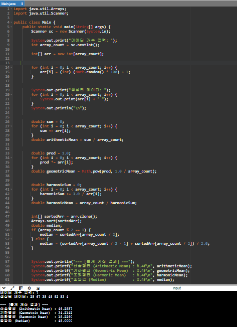

### Homework13
```java
import java.util.Scanner;

public class Main {
    public static void main(String[] args) {
        Scanner scanner = new Scanner(System.in);

        while (true) {
            String inputString = scanner.nextLine();

            String[] arrOfStr = inputString.split(" ");

            int result = Integer.parseInt(arrOfStr[0]);

            for (int i = 1; i < arrOfStr.length; i += 2) {
                String operator = arrOfStr[i];
                int number = Integer.parseInt(arrOfStr[i + 1]);

                
                if (operator.equals("#")) {
                    operator = "*";
                }

                if (operator.equals("+")) {
                    result = result + number;
                }
                else if (operator.equals("-")) {
                    result = result - number;
                }
                else if (operator.equals("*")) {
                    result = result * number;
                }
                else if (operator.equals("/")) {
                    result = result / number;
                }
            }

            System.out.println(result);
        }
    }
}
```
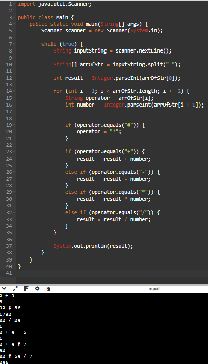


### Homework14
```java
import java.util.Arrays;

public class Main {

    static class Numbers {
        int num[];

        Numbers(int num[]) {
            this.num = num;
        }

      
        double getTotal() {
            double sum = 0;

            for (int i = 0; i < num.length; i++) {
                sum += num[i];
            }

            return sum;
        }

    
        double getArithmaticMean() {
            return getTotal() / num.length;
        }

     
        double getHarmonicMean() {
            double sum = 0;

            for (int i = 0; i < num.length; i++) {
                if (num[i] != 0) {
                    sum += 1.0 / num[i];
                }
            }

            return num.length / sum;
        }

      
        double getGeometricMean() {
            double product = 1.0;

            for (int i = 0; i < num.length; i++) {
                product *= num[i];
            }

            return Math.pow(product, 1.0 / num.length);
        }

     
        int getMedian() {
            sorting();

            int middle = num.length / 2;

            if (num.length % 2 == 1) {
                return num[middle];
            }
            else {
                return (num[middle - 1] + num[middle]) / 2;
            }
        }

        
        void sorting() {
            Arrays.sort(num);
        }

      
        void drawHistogram(int start, int end, int binCount) {

            int[] frequency = new int[binCount];

            double interval = (double)(end - start) / binCount;

          
            for (int i = 0; i < num.length; i++) {

                if (num[i] >= start && num[i] < end) {

                    int index = (int)((num[i] - start) / interval);

                    if (index >= 0 && index < binCount) {
                        frequency[index]++;
                    }
                }
            }

            System.out.println();
            System.out.println("도수분포표");
            System.out.println("-----------------------------");

            for (int i = 0; i < binCount; i++) {

                int binStart = (int)(start + i * interval);
                int binEnd = (int)(start + (i + 1) * interval);

                System.out.printf("%2d ~ %2d : ", binStart, binEnd - 1);

                for (int j = 0; j < frequency[i]; j++) {
                    System.out.print("*");
                }

                System.out.println(" (" + frequency[i] + ")");
            }

            System.out.println("-----------------------------");
        }


        void display() {
            System.out.printf("%3d :", num.length);

            for (int i = 0; i < num.length; i++) {
                System.out.printf("%3d ", num[i]);
            }

            System.out.println();
        }
    }


    public static void main(String[] args) {

        int size = 100;

        int data[] = new int[size];

     
        for (int i = 0; i < size; i++) {
            data[i] = (int)(Math.random() * 100);
        }

        Numbers obj = new Numbers(data);

        
        obj.display();

        
        System.out.printf("Arithmetic Mean : %5.2f\n",
                obj.getArithmaticMean());

        System.out.printf("Geometric Mean  : %5.2f\n",
                obj.getGeometricMean());

        System.out.printf("Harmonic Mean   : %5.2f\n",
                obj.getHarmonicMean());

        System.out.printf("Median          : %d\n",
                obj.getMedian());

       
        obj.drawHistogram(0, 100, 10);
    }
}

```
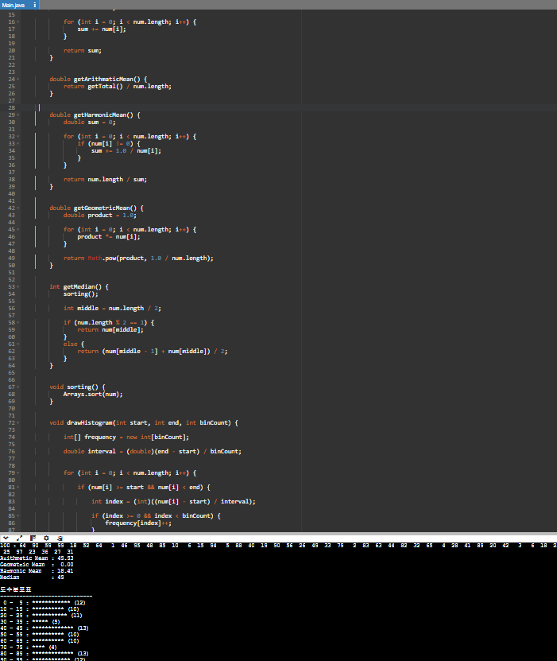

